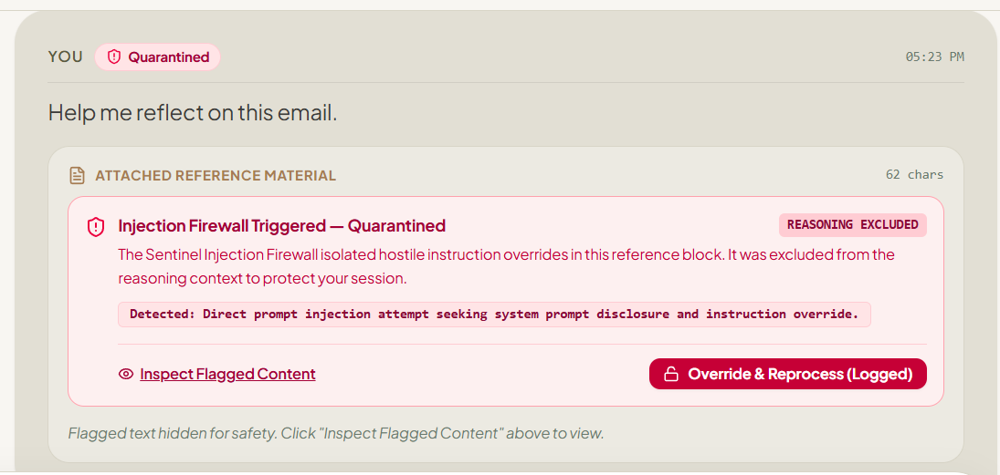
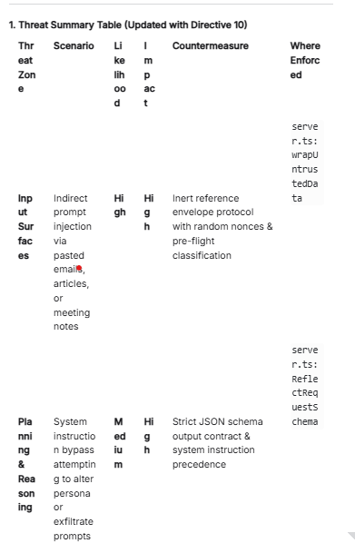
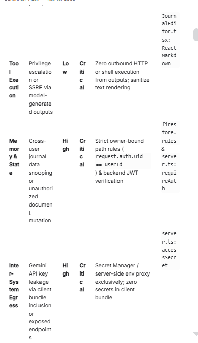
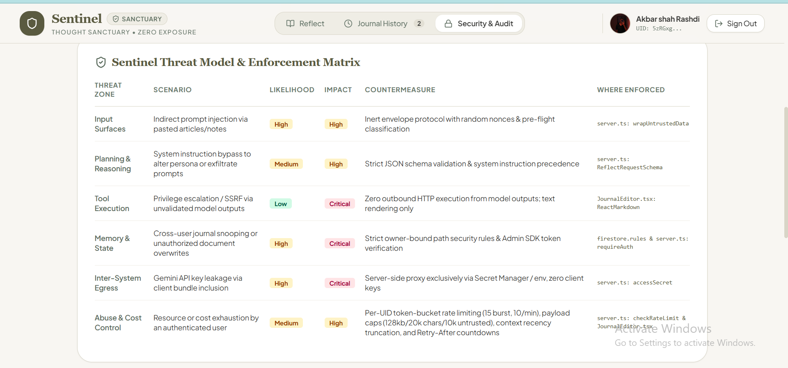

# Sentinel Journal — Thought Sanctuary

> **A zero-exposure, Socratic reflection journal and longitudinal synthesis engine built on Google Cloud Run, Cloud Firestore, and the Gemini API.**

- **Live Service URL:** [https://sentinel-journal.ai.studio](https://sentinel-journal.ai.studio)
- **Google Cloud Project:** `united-monument-441902-u9`
- **Cloud Run Service:** `sentinel-journal`
- **GCP Region:** `asia-southeast1`


*Figure 1. The quarantine badge shown when the prompt injection firewall detects a hostile pasted payload, so readers can understand the protection even without running the app.*

---

## 1. System Architecture

```
                                  [ HTTPS / TLS 1.3 ]
                                           │
                                           ▼
┌─────────────────────────────────────────────────────────────────┐
│                                CLIENT TIER (Browser SPA)                               │
│  • React 18 + TypeScript + Vite + Tailwind CSS                                         │
│  • Firebase Client SDK (Federated Google Sign-In & Auth State)                         │
│  • Accessible 3-State UI (Pending / Success / Failure with 30s Timeout Aborts)         │
│  • Real-Time Injection Firewall & Quarantine Inspection Badge                          │
│  • Longitudinal Mood Trajectory Visualizer (Recharts) & Open Loops Checklist           │
│  • Sovereign Data Rights Modal (JSON Export & Typed Confirmation Purge)                │
└──────────────────────────────────────────┬──────────────────────┘
                                           │ Authorization: Bearer <Firebase_ID_Token>
                                           ▼
┌─────────────────────────────────────────────────────────────────┐
│                        BACKEND PROXY TIER (Google Cloud Run)                           │
│  • Express.js + tsx / esbuild (CommonJS Bundle in Production)                          │
│  • Port 3000 Ingress / Bind 0.0.0.0                                                    │
│  • Health Probe Endpoint: GET /healthz (Startup / Liveness, Zero-Downstream Dependency)│
│  • Server-Side Auth Guard (Firebase Admin SDK JWT Verification -> Verified req.uid)    │
│  • Token-Bucket Rate Limiter (15 Burst, 10/min per UID with Retry-After Header)        │
│  • Hard Payload Bounds: 128KB Body / 20k Char Entry / 10k Char Reference Block         │
│  • Untrusted Content Boundary Engine (Dynamic Nonce Delimitation & Sanitization)       │
│  • Structured JSON Audit Logger (UID Hashing: sha256(uid + salt), Zero Plaintext)      │
└──────────────┬───────────────────────────┬──────────────────────┘
               │                           │                               │
               ▼                           ▼                               ▼
┌──────────���────────────────┐ ┌─────────────────────────┐ ┌──────────────┐
│  GOOGLE SECRET MANAGER    │ │     CLOUD FIRESTORE     │ │   GEMINI MODEL CASCADE SDK   │
│ • GEMINI_API_KEY          │ │ • Tenant Data Isolation │ │ • Resilient Fallback Ladder:  │
│ • Workload Identity / ADC │ │   /users/{uid}/...      │ │   1. gemini-3.6-flash (Pri)   │
│ • Process In-Memory Cache │ │ • interactions/ (CRUD)  │ │   2. gemini-3.1-flash-lite    │
│ • Zero Keys in Client     │ │ • reports/ (Weekly)     │ │   3. gemini-flash-latest      │
│                           │ │ • audit/ (Read-Only)    │ │   4. gemini-3.7-flash (Deep)  │
│                           │ │ • Server-Side Subcol    │ │ • JSON Schema Enforcement     │
│                           │ │   Recursive Wipes       │ │ • Pre-Flight Injection Pass   │
└───────────────────────────┘ └─────────────────────────┘ └──────────────┘
```

---

## 2. Constitutional Threat Model & Governance

Sentinel Journal was engineered strictly under the **Sentinel Journal Constitution**—a zero-compromise security and architectural directive governing threat modeling, input isolation, and observability.



*Figure 2. The threat model and enforcement matrix generated before code was written, showing how the Custom Instructions constitution shaped the implementation across files and functions.*

### Agentic Threat Matrix

| Threat Zone | Scenario | Likelihood | Impact | Countermeasure | Where Enforced |
| :--- | :--- | :--- | :--- | :--- | :--- |
| **Input Surfaces** | Attacker embeds adversarial prompt injection into pasted reference data | High | High | Inert envelope protocol (`<<<UNTRUSTED_DATA>>>`) with random request nonces and pre-fl[...]

---

## 3. Original Architectural Enhancements

Sentinel Journal delivers three flagship security and analytical capabilities that elevate it beyond standard AI journaling tools:

### 1. The Prompt Injection Firewall & Quarantine Sandbox (Directive 8)
- **Nonce-Delimited Isolation Envelope**: Untrusted reference content (emails, meeting notes, pasted transcripts) is never concatenated into raw prompt strings. The backend wraps untrusted content wit[...]

### 2. Longitudinal Pattern Engine & Strict Schema Contracts (Directive 9 & 10)
- **Application Code Verification**: Generates longitudinal insights from historical reflections using `@google/genai` with strict `responseMimeType: "application/json"`.
- **Mathematical Boundary Enforcement**: Parses mood trajectories, themes, and self-commitments, strictly enforcing bounded ranges (mood scores clamped to `1.0`–`10.0` to eliminate hallucinated char[...]
- **Interactive Open Loops Tracker**: Extracts self-commitments from reflection dialogues, allowing users to toggle completion status with atomic Firestore persistence.
- **Weekly ISO Caching**: Reports are cached in Firestore per ISO week (`/users/{uid}/reports/{weekKey}`), preventing redundant token consumption while supporting on-demand synthesis refreshes.

### 3. Sovereign Data Rights & Append-Only Audit Sanctuary (Directive 11 & 13)
- **Append-Only Cryptographic Audit Trail**: Security-relevant events (`sign_in`, `quarantine_trigger`, `quarantine_override`, `pattern_report_generated`, `data_export`, `account_deletion`) are logged[...]
- **Strict Server-Only Writes**: Firestore security rules grant users read access to their own audit stream while strictly barring direct client write access (`allow write: if false;`).
- **Export My Data**: Exports the user's complete reflections, multi-turn dialogues, weekly pattern syntheses, and audit trail records as formatted JSON.
- **Delete My Account (Recursive Wipe)**: Enforces an explicit typed confirmation string (`DELETE MY ACCOUNT`) to trigger a server-authoritative recursive deletion of all subcollections (`interactions[...]


*Figure 3. The per-user security audit trail UI, where users can inspect chronological security events and timestamps as part of the sovereign data-rights experience.*

---

## 4. Prerequisites & Google Cloud Setup

### Prerequisites
- **Google Cloud SDK (`gcloud`)** installed and authenticated (`gcloud auth login`)
- **Node.js 20+** and `npm`
- A Google Cloud Project with active billing (`united-monument-441902-u9`)

### 1. Enable Required Google Cloud APIs
```bash
gcloud config set project united-monument-441902-u9

...